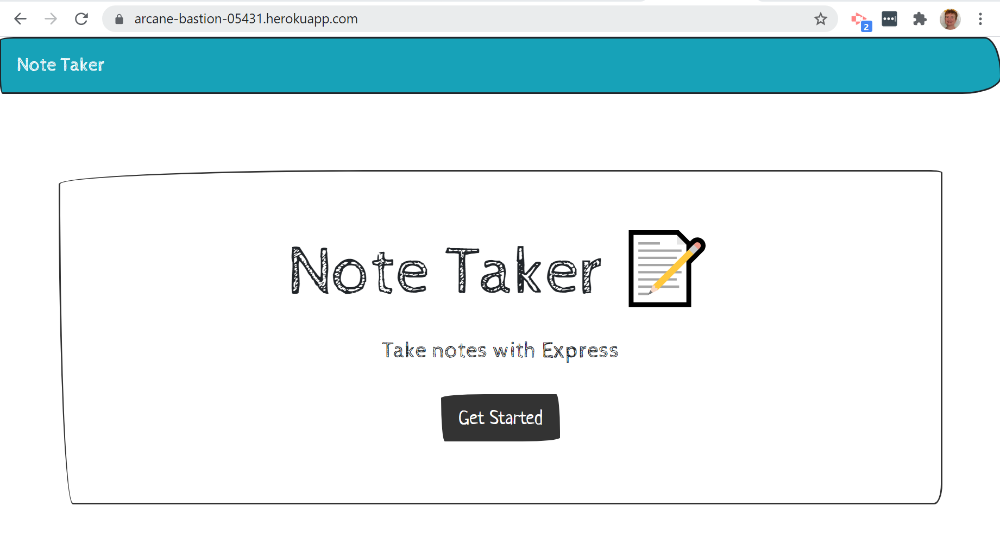
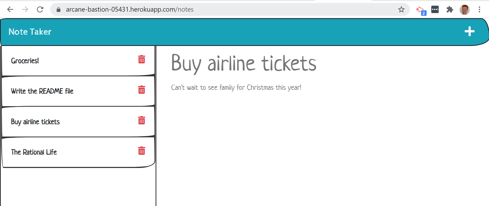

# Note Taker Starter Code

# Note Taker
This challenge for Module 11 of the Coding Bootcamp is to create an app that can be used to write and save notes.

* [User Story](#userStory)

* [Requirements](#requirements)

* [Technologies Used](#techUsed)

* [What I Learned](#whatILearned)

* [Note Taker Screenshots](#webImage)

* [Note Taker URL](#projectURL)

* [Note Taker Heroku Git Link](#projectHeroku)

* [Contact Me](#contactMe)

---

## User Story

AS A small business owner
I WANT to be able to write and save notes
SO THAT I can organize my thoughts and keep track of tasks I need to complete

--- 

## Requirements
* The app must start at a landing page with a link to a notes page.
* Clicking on the link to the notes page presents the user with a page of existing notes listed in the left hand column, a right hand column that has fields to enter a new note with a title and text, and a navigation bar at the top containing a Write icon.
* After entering a new note title and new note text, a Save icon will appear in the navigation at the top of the page.
* Clicking the Save icon will save the entered title and text and the note will appear in the left hand column with the other existing notes.
* Clicking on an existing note in the left hand list will make the note title and text appear in the right hand column (read only).
* Clicking on the Write icon will clear the fields in the right hand column so the user can enter a new note.
* BONUS: Clicking the delete button will delete the associated note and remove it from the list on the left hand side. 

---

## Technologies Used
* Heroku
* Node.js
* Express
* Bootswatch (based off of bootstrap): I used a different theme than what was in the starter code. The one I selected is more fun than the nice-but-boring one originally used.
* Fontawesome
* json
* Insomnia Core

--- 

## I learned how to...
* Configure an Express.js back to serve static HTML files.
* Configure an Express.js back end to create an API to handle GET and POST requests.
* Parse parameters in server-side routes.
* Submit form data to a server.
* Implement separation of concerns for routing.
* Deploy a server-side application to the Heroku platform.
* Identify how client-side requests relate to server-side responses.

---

## Note Taker Screenshots

---

## Note Taker URL
[Note Taker URL](https://note-taker-bjackels5.herokuapp.com/)

---

## Note Taker Heroku Git Link
[Note Taker Heroku Git Link](https://git.heroku.com/note-taker-bjackels5.git
)

---

## Contact Me
You can reach me, Brenda Jackels, at bjackels5@gmail.com.